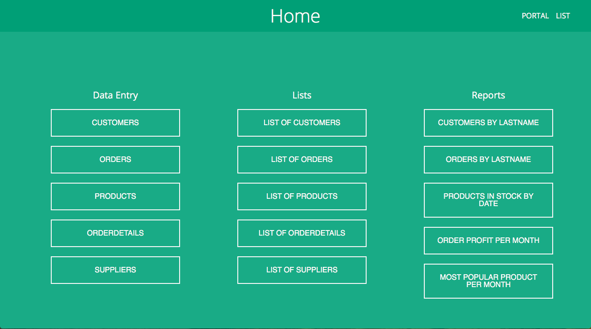
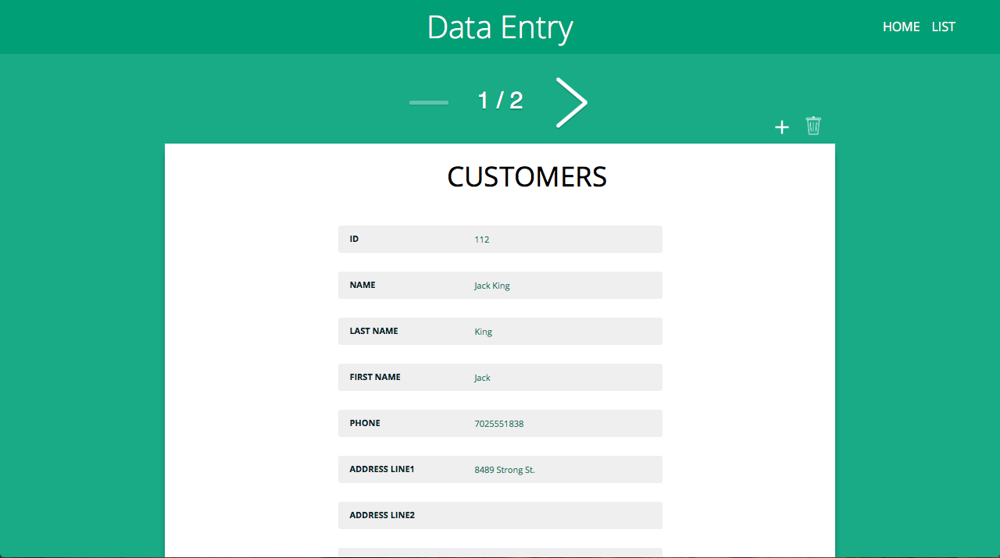

# Simple Database Manager (DBMS)

This is a very simple database manager that I made for a school project a while back. It works well as a database management system and currently, it is set up as an Australian Football (AFL) merchandise database (this is easy to change to your needs).

In essence, it has customers, products, orders and suppliers tables and can be viewed and edited in either a list view or portal view. There is a full invoice generator system included for the orders table. There are some examples of reports that can be made such as the most popular product per month. There is a graph that displays the data for some of the reports.




## Disclaimer

I know that in its current state it has some errors and isn't designed very well and looking back I would have made this system very differently now. I will be updating it in the future but any contributions are greatly appreciated.

## Why?

I will be updating this repository in the future but due to a request for something similar on StackOverflow I decided to post this for any that may need a system similar to this.

## Getting Started

These instructions are purely for getting you a copy of the project up and running on your local machine for development and testing purposes. On my local machine, I use a program called [MAMP](https://www.mamp.info), I highly recommend it and it's free! See deployment for notes on how to deploy the project on a live system.

### Prerequisites

What you need to have installed to use the software. I recommend installing [MAMP](https://www.mamp.info) as it is a GUI interface that installs and manages all of these packages, I cannot recommend it enough, it saves you a great deal of time.

If you haven't already got it [Sublime Text](https://www.sublimetext.com) is probably the best text editor for coding, seriously just get it, it's free!

```
PHP Server
Apache Server
MYSQL Server
```

### Installing

Simply put the contents of the folder into your web server folder.

E.g for the default location of MAMP's web directory on macOS
```
/Applications/MAMP/htdocs/
```

So that your file structure should look like
```
/Applications/MAMP/htdocs/assets
/Applications/MAMP/htdocs/invoice
/Applications/MAMP/htdocs/index.php
/Applications/MAMP/htdocs/...
```

Upload the Database Save.sql to your MySQL database.

Edit the database config at the top of each PHP file to fit your database details (I know it's tedious but it's late and I'll probably just add a config file tomorrow).

```
$servername = "localhost";
$username = "root";
$password = "root";
$dbname = "afl";
```

If it works you should be getting the results like in the images above.

### Styling

Style it to how it fits your needs. I will be making a template feature so please send them I will be happy to receive them.

CSS file in
```
assets/css/style.css
```

## Deployment

After testing this and modifying to your needs on your local system simply repeat the install process for your public web server.

## Contributing

Please read [CONTRIBUTING.md](CONTRIBUTING.md) for details on our code of conduct, and the process for submitting pull requests to us.

## Versioning

This repository [SemVer](http://semver.org/) for versioning. For the versions available, see the [tags on this repository](https://github.com/TomGrozev/Simple-Database-Manager--DBMS-/tags). 

## Authors

* **Tom Grozev** - *Initial work* - [TomGrozev](https://github.com/TomGrozev)

See also the list of [contributors](https://github.com/TomGrozev/Simple-Database-Manager--DBMS-/contributors) who participated in this project.

## License

This project is licensed under the MIT License - see the [LICENSE.md](LICENSE.md) file for details

## Acknowledgments

* Hat tip to anybody's code that was used that I failed to mention
